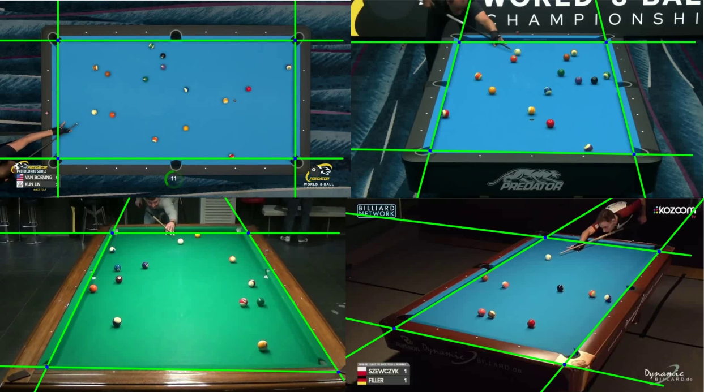
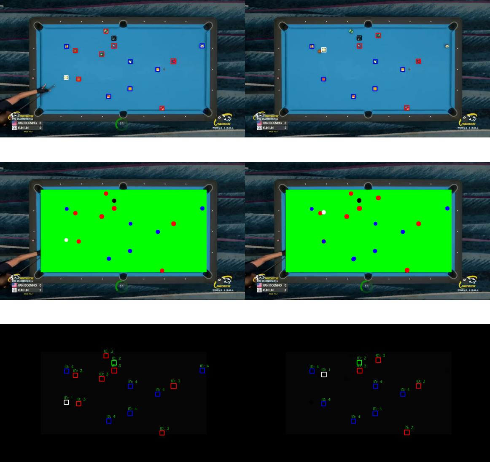
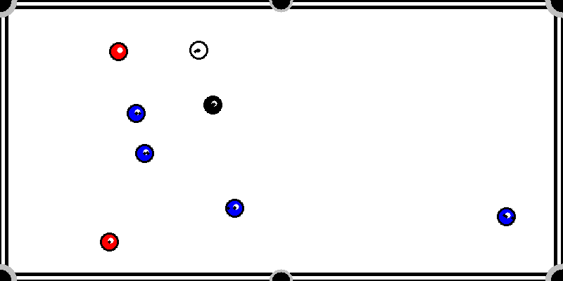

# Sport Video Analysis for Billiard Matches
This project aims to develop a computer vision system for analyzing video footage of "Eight Ball" billiard games. The system will leverage computer vision techniques to provide real-time insights into the game's state, including ball positions, trajectories, and game progress. The output will be visualized as a 2D top-view minimap of the playing field.
## Authors

- [@Mohammadhossein Akbari](https://github.com/r4stin)
- [@Zahra_Rahgooy](https://github.com/ZahraRahgooy)
- [@Giacomo_D’Andria](https://github.com/giacomodandria)

## Features

- **Playing Field Detection**: Identifies the boundaries of the playing field.

- **Ball Detection, Localization and Segmentation**: Recognizes and tracks all balls on the table and segments them into categories.

- **Top-View Visualization**: Updates a 2D minimap with current ball positions and trajectories.

# Instructions

	$ mkdir build

	$ cd build

	$ cmake -DCMAKE_BUILD_TYPE=Release ..

	$ make

	$ cd .. && cd bin

Usage Example:

Usage: ./Starter < Input video path >  < Output video path > 

